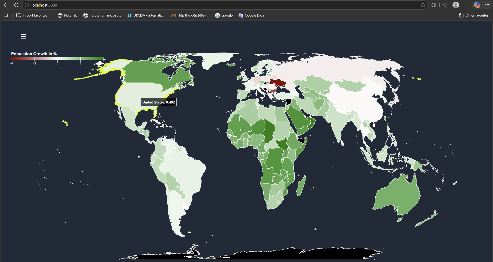
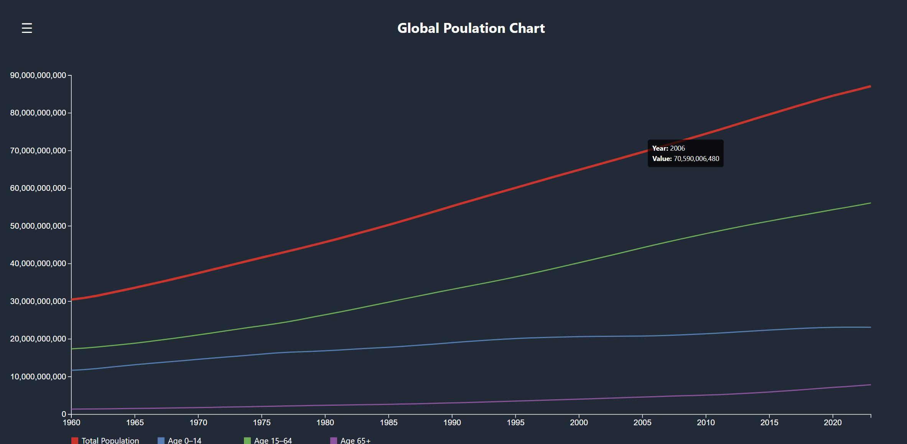

# Global Population Prediction
An AI-powered population analytics and forecasting platform that combines machine learning, ETL pipelines, and interactive D3.js dashboards to analyze global demographic trends from 1960–2023 across 200+ countries.
---

 
## Dashboard Features
 
- **Choropleth world map** — population distribution by country with color-coded scale
- **Global trend chart** — total world population from 1960–2023
- **Growth rate chart** — annual global population growth rate over time
- **Country selector sidebar** — explore any country's demographic profile
- **Country trend chart** — country-level population history and forecast
- **Birth vs death rate chart** — per-country birth and death rate trends
- **Top 10 comparison chart** — most populous countries side by side
- **D3.js legend** — interactive color scale for map visualization

---

## Steps to Run

**1. Clone the repository**
 
```bash
git clone https://github.com/vuchau0802/Global-Population-Prediction.git
cd Global-Population-Prediction
```
 
**2. Start a local server**
 
```bash
python -m http.server 8080
```
 
**3. Open in browser**
 
```
http://localhost:8080
```

---

## Demo

> The dashboard with choropleth maps, demographic charts, and country-level comparisons.





